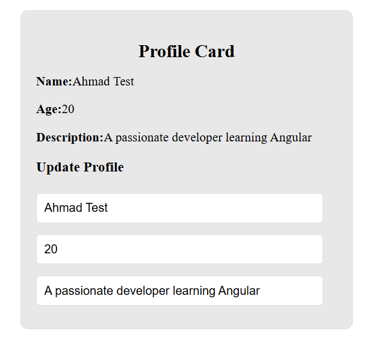

# Angular Profile Card

This is a simple **Angular 19** project that demonstrates **two-way data binding**, **template-driven forms**, and **basic component styling** using a profile card layout. The project allows real-time updates to a user's name, age, and description through input fields.

## 🔧 What I Built

I developed a responsive **Profile Card** component using:

- **Angular CLI 19.1.8**
- **Component-based architecture**
- **Two-way data binding with `[(ngModel)]`**
- **Template-driven approach (no reactive forms)**
- **Basic HTML + CSS styling with clean UI**

### 💡 Key Features

- Displays user profile information (name, age, description)
- Allows live editing of profile fields
- Real-time data update using `[(ngModel)]` (no form submission needed)
- Styled card layout with border, padding, and shadows

## 🧱 Technologies Used

- **Angular 19**
- **TypeScript**
- **HTML & CSS**
- **FormsModule** from `@angular/forms` for binding inputs

## 📁 Project Structure

- `app.component.ts` — Logic for profile data and form binding  
- `app.component.html` — Template for profile card and input fields  
- `app.component.css` — Custom styles for card layout and inputs  

## 🚀 Running the Project

To start the development server, run:

```bash
ng serve

## 📸 Screenshot


